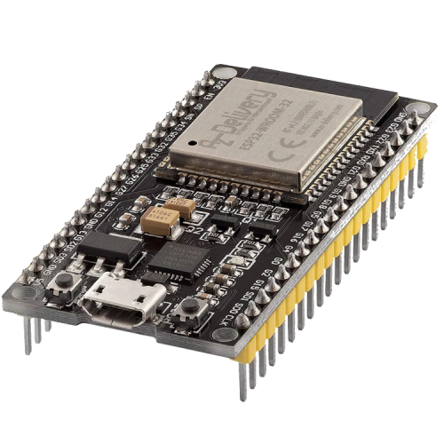
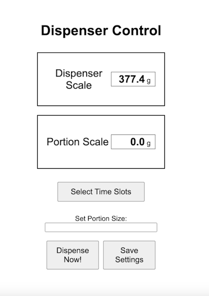
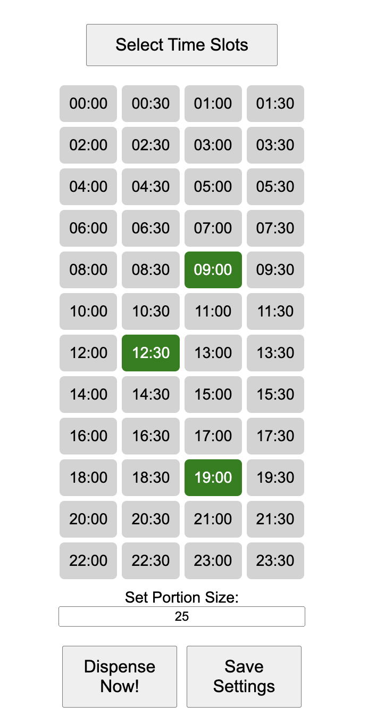

# Cat Food Dispenser Project
## Tags  
🎯 **#CatFoodDispenser** | ⚡ **#ESP32** | 🛠 **#Arduino** | 🌐 **#IoT** | 🐾 **#SmartPetFeeder**  
🤖 **#Automation** | 🔧 **#EmbeddedSystems** | 🎮 **#ServoMotor** | ⚖️ **#LoadCell** | 📡 **#WiFi**  
💻 **#ArduinoIDE** | 🏡 **#SmartHome** | 🎯 **#Microcontrollers**

## Overview
This project is an automated cat food dispenser that uses an ESP32 microcontroller to control servo motors, load cells (scales), and a vibration motor. The dispenser can be programmed to release a specific portion of food at scheduled times. It also includes a web server interface for configuration and monitoring.

## Hardware Requirements
- **MCU**: ESP32  
  
- **Servo Motors**: 2 x Servo Motors
- **Load Cells**: 2 x HX711 (for scales)
- **Power Supply**: MB102
- **Vibration Motor**: 1 x Vibration Motor
- **Structure**: Cardboard, Glue, Tape, Wires, and Breadboard

## Software Requirements
- **Arduino IDE**: For programming the ESP32.
- **Libraries**:
  - `WiFi.h`
  - `AsyncTCP.h`
  - `ESPAsyncWebServer.h`
  - `LittleFS.h`
  - `ArduinoJson.h`
  - `HX711.h`
  - `Servo.h`
  - `HTTPClient.h`
  - `time.h`

## Project Layout

### Source Code Organization
The project is organized into several files, each handling a specific functionality:

- **wifiSupport.cpp**: Handles Wi-Fi connection and status checks.
- **CatDispenser.ino**: Main file that initializes the system and runs the state machine.
- **powerSaving.cpp**: Manages power-saving modes.
- **scaleSupport.cpp**: Handles calibration and reading of the load cells.
- **servoSupport.cpp**: Controls the servo motors.
- **stateMachine.cpp**: Implements the state machine logic for the dispenser.
- **webServerSupport.cpp**: Manages the web server for configuration and monitoring.
- **timerSupport.cpp**: Handles time synchronization and scheduling.
- **webServer.html**: Implements the front-end interface for controlling and monitoring the dispenser.

## User Interface

### Web Interface Overview
The dispenser has a simple web interface for setting up and monitoring food dispensing.  


### Features  
- **Portion Control**: Users can set the portion size for each feeding session.
- **Scheduled Feeding**: Time slots can be selected to schedule food dispensing.
- **Live Monitoring**: The dispenser scale shows real-time food levels.
- **Refill Alerts**: Notifications are sent when the food level is low.

#### Example of a low food level alert:


#### Setting feeding times via the web interface:


### How to Build, Burn, and Run the Project

1. **Install Arduino IDE**:
   - Download and install the Arduino IDE from [Arduino's official website](https://www.arduino.cc/en/software).

2. **Install Required Libraries**:
   - Open the Arduino IDE and go to `Sketch > Include Library > Manage Libraries`.
   - Search for and install the required libraries.

3. **Set Up the ESP32 Board**:
   - Add the following URL to `File > Preferences > Additional Boards Manager URLs`:
     ```
     https://dl.espressif.com/dl/package_esp32_index.json
     ```
   - Install the `esp32` package from the Boards Manager.

4. **Select the Board and Port**:
   - Select `ESP32 Dev Module` as the board.
   - Choose the correct port.

5. **Load the Project**:
   - Open `CatDispenser.ino` in Arduino IDE with all associated files.

6. **Compile and Upload**:
   - Compile the code using the `Verify` button.
   - Upload the code using the `Upload` button.

7. **Run the Project**:
   - The ESP32 will start the cat food dispenser program.
   - Access the web interface to configure settings.

## User Guide

### 1. Initial Setup
- Power on the ESP32 and ensure it is connected to your Wi-Fi network.
- **Important**: Before uploading the code, modify the Wi-Fi credentials in `CatDispenser.ino`:
  ```cpp
  initWiFi("Your_WiFi_SSID", "Your_WiFi_Password");
  ```
- Access the web interface via the ESP32's IP address.

### 2. Configure Dispenser
- **Set Portion Size**:
  - Enter the desired portion size (in grams).
  - Example: Enter `30` for 30g.
- **Select Time Slots**:
  - Choose multiple time slots for food dispensing.
  - Example: `08:00` and `18:00` for twice daily.
- **Save Settings**:
  - Click `Save` to store settings.

### 3. Monitor and Control
- **Dispenser Status**:
  - View current weight and portion scales.
  - Example: `377.4g` available, `0.0g` dispensed.
- **Manual Dispense**:
  - Click `Dispense Now!` to release food immediately.

### 4. Refill Notification
- If food is low, an alert appears on the web interface.
- A Telegram notification is sent.
- Example: `Dispenser scale: 21.4g, Portion scale: 30.3g` → Prompt to refill.

### 5. Troubleshooting
- **ESP32 not responding?**
  - Check Wi-Fi connection.
  - Check serial monitor for errors.
  - Verify portion size and time slots.

## Links
- **PowerPoint Presentation**: [Link to your PowerPoint presentation]
- **YouTube Video**: [Link to your YouTube video]

## Conclusion
This project automates cat food dispensing with remote monitoring and control. The web interface allows users to easily configure and monitor the system, making it a practical IoT solution for pet care.


